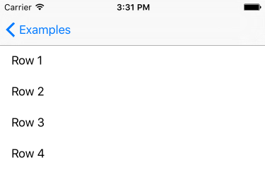
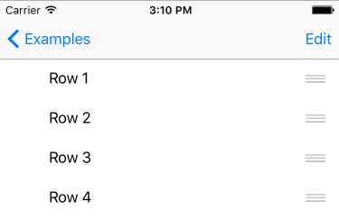
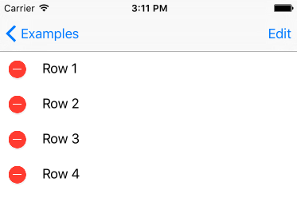
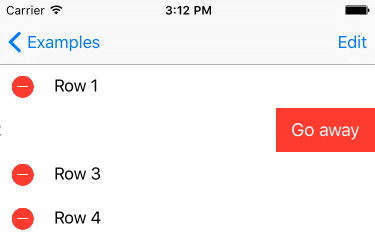
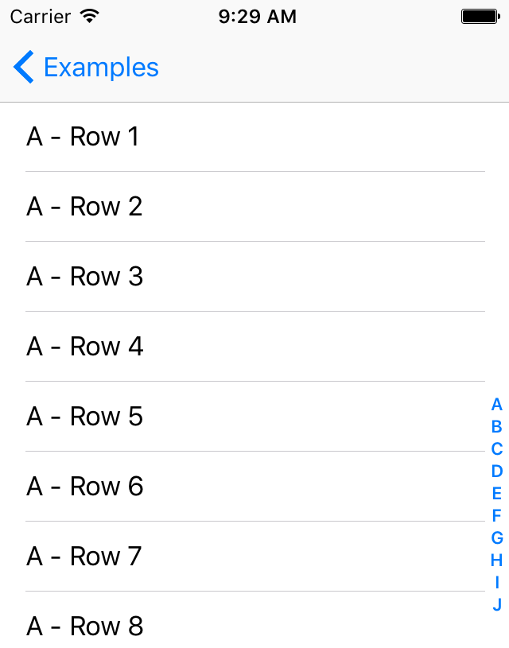

# TableManager
[](http://cocoapods.org/pods/TableManager)
[]()
[]()
[]()
[](http://cocoapods.org/pods/TableManager)
[](http://cocoapods.org/pods/TableManager)
[](https://github.com/Carthage/Carthage)
[](https://travis-ci.org/Morbix/TableManager)


**TableManager** is an extension of `UITableView`. Manipulate your table in an easier way. Add sections and rows. Configure headers and footers. Hide and show rows individually. And this library will handle all the protocols for you. The table the way it should be.

- [Requirements](#requirements)
- [Installation](#installation)
- [Basic Usage](#basic-usage)
    - [Configure the table with only 2 tiny steps](#configure-the-table-with-only-2-tiny-steps)
- [Documentation](#documentation)
    - [Rows](#rows)
    - Sections
    - [Visibility](#visibility)
    - [Configuring a custom cell](#configuring-a-custom-cell)
    - [Row selection event](#row-selection-event)
    - [Selected row](#selected-row)
    - [Visible rows](#visible-rows)
    - [UIScrollViewDelegate events](#uiscrollviewdelegate-events)
    - [Drag & Drop feature or Reordering](#drag--drop-feature-or-reordering)
    - [Deletion](#deletion)
    - Method Chaining
    - Get Height
- [CHANGELOG](CHANGELOG.md)
- [Contribute](#contribute)
- [Contributors](#contributors)
- [License](#license)

## Requirements

It requires Xcode 8.0+ and Swift 3.0.

Your project deployment target must be `iOS 8.0+`

## Installation

### CocoaPods

TableManager is available through [CocoaPods](http://cocoapods.org). To install
it, simply add the following line to your Podfile:

```ruby
pod 'TableManager'
```

### Manually

You can also install it manually just dragging [TableManager](https://github.com/Morbix/TableManager/blob/master/TableManager.swift) file to your project.


## Basic Usage

### Configure the table with only 2 tiny steps

##### Step 1 - Import TableManager
```swift
import TableManager
```

##### Step 2 - Add a Row with a configuration
```swift
tableView.addRow().setConfiguration { _, cell, _ in 
    cell.textLabel?.text = "Row \(number)"
}
```

#### Complete Example
```swift
import TableManager

class ViewController: UITableViewController {
    override func viewDidLoad() {
        super.viewDidLoad()

        (1...10).forEach { n in
            tableView.addRow().setConfiguration { _, cell, _ in 
                cell.textLabel?.text = "Row \(n)"
            }    
        }
    }
}
```


## Documentation

### Rows
The magic starts here: adding Rows.

##### Directly using UITableView's extension
```swift
tableView.addRow()
```

##### Or instance a row and add it in the table
```swift
let someRow = Row()
tableView.addRow(someRow)
```

##### You can add a row in a specific section, e.g. the last section
```swift
let someRow = Row()
tableView.sections.last?.addRow(someRow)
```

### Visibility
You can change the property `visible` from any Section and any Row. 
```swift
someRow.setVisible(true)

someSection.setVisible(false)
```

### Configuring a custom cell
You can set a identifier and the `configuration` property:
```swift
let row = Row(identifier: "CellBasic", object: someString)

row.setConfiguration { (row, cell, indexPath) in
    if let text = row.object as? String {
        cell.textLabel?.text = text
    }
}

tableView.addRow(row)
```

Or declare a `Row.Configuration` and attribute it to any row:
```swift
let configuration: Row.Configuration = { (row, cell, indexPath) -> Void in
    if let text = row.object as? String {
        cell.textLabel?.text = text
    }
}
let rowA = tableView.addRow(Row(identifier: "CellBasic", object: someObject))
rowA.setConfiguration(configuration)

let rowB = tableView.addRow(Row(identifier: "CellBasic", object: otherObject))
rowB.setConfiguration(configuration)
```


### Row selection event 
You can set the `didSelect` property:
```swift
let row = Row(object: someString)

row.setDidSelect { (row, tableView, indexPath) in
    if let text = row.object as? String {
        print(text + " selected")
    }
}

tableView.addRow(row)
```

Or declare a `Row.DidSelect` and attribute it to any row:
```swift
let didSelect: Row.DidSelect = { (row: Row, tableView: UITableView, indexPath: NSIndexPath) -> Void in
    if let text = row.object as? String {
        print(text + " selected")
    }
}

let rowA = tableView.addRow(Row(object: someString))
rowA.setDidSelect(didSelect)

let rowB = tableView.addRow(Row(object: someString))
rowB.setDidSelect(didSelect)
```

### Selected row
You can get the row that corresponds the selected cell
```swift
if let selectedRow = tableView.selectedRow() {
    print('the selected row is: ' + selectedRow.object)
}
```

### Visible rows
You can get the visible rows that corresponds the cells appearing in the UI for the user
```swift
if let visibleRows = tableView.visibleRows() {
    visibleRows.forEach { row in
        print(row)
    }
}
```

### UIScrollViewDelegate events
You can handle all the scrollview delegates by your own
```swift
class TableViewController: UITableViewController {

    override func viewDidLoad() {
        super.viewDidLoad()
            
        tableView.scrollViewDelegate = self
        
        // [...]
    }
    
    override func scrollViewDidScroll(_ scrollView: UIScrollView) {
        print(scrollView.contentOffset.y)
    }
    
} 
```

### Drag & Drop feature or Reordering
You can make a row draggable when table is editing just passing `true` in method `setCanMove`:
```swift
let row = tableView.addRow()
            
row.setCanMove(true)

// [...]

tableView.editing = true
```


### Deletion
You can make a row deletable when table is editing just passing `true` in method `setCanDelete`:
```swift
let row = tableView.addRow()
            
row.setCanDelete(true)

// [...]

tableView.editing = true
```


And you can easily edit the title confirmation too:
```swift
row.setCanDelete(true, titleForDeleteConfirmation: "Go away")
```


### Index Titles
You can make an Index Title(like contacts list on iOS) by just passing the `indexTitle` for each section that you want to show in indexTitles, calling the method `setIndexTitle`:
```swift
let section = tableView.addSection().setIndexTitle("A")
```


## CHANGELOG
[Go to CHANGELOG](CHANGELOG.md)

## Contribute

Feel free to submit your pull request, suggest any update, report a bug or create a feature request.

Just want to say hello? -> [morbin_@hotmail.com](mailto://morbin_@hotmail.com)

## Contributors

Author: [@Morbin_](https://twitter.com/Morbin_) / [fb.com/hgmorbin](https://www.facebook.com/hgmorbin)

See the people who helps to improve this project: [Contributors](https://github.com/Morbix/TableManager/graphs/contributors) ♥


## License

TableManager is available under the MIT license. See the LICENSE file for more info.
